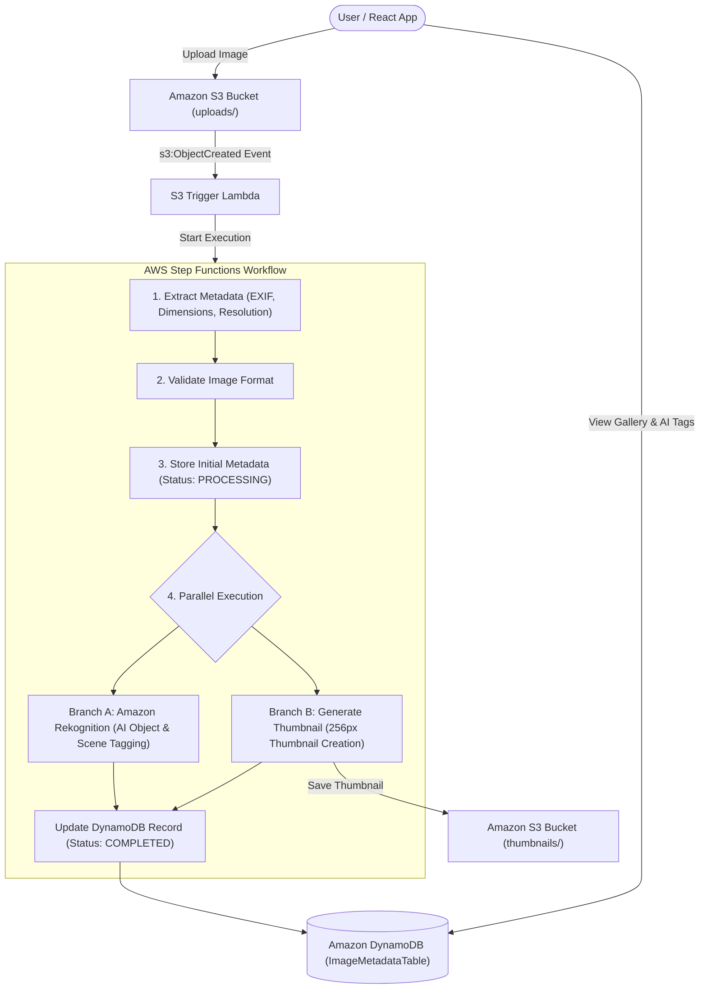

# Serverless Event-Driven Image Processing Pipeline on AWS

A cloud-native, serverless, event-driven image processing and analysis pipeline built on AWS. The application automatically processes uploaded images, extracts EXIF metadata, generates optimized thumbnails, performs AI-powered object/scene recognition, and stores structured metadata for interactive query via a React frontend.

---

## 🌟 Key Highlights & Architecture Features

* **Serverless & Event-Driven**: Built an event-driven image processing pipeline on AWS for automated image analysis and metadata extraction triggered immediately upon S3 uploads.
* **Workflow Orchestration**: Leveraged **AWS Lambda**, **Amazon Rekognition**, and state machine orchestration via **AWS Step Functions** to enable scalable, reliable, and fault-tolerant parallel processing.
* **Structured Cloud Storage**: Designed a cloud-native, highly available solution using **Amazon DynamoDB** for structured metadata storage and **Amazon S3** for media asset hosting, ensuring seamless integration across all services.

---

## 📐 Pipeline Architecture & Workflow



### Behind the Scenes Processing Sequence:
1. **Upload Trigger**: When a user uploads a JPEG/PNG image from the React frontend, it lands in the S3 bucket (`PhotoRepoBucket`).
2. **S3 Event Notification**: An `s3:ObjectCreated:*` event invokes the `S3Trigger` Lambda function, extracting user/album context and kicking off the AWS Step Functions State Machine (`ImageProcStateMachine`).
3. **Sequential Metadata Extraction**:
   - **Extract Metadata**: Lambda inspects image headers to extract EXIF data, resolution, dimensions, and mime types.
   - **Format Validation**: Verifies format integrity and allowed file extensions.
   - **Initial Persistence**: Stores initial record into Amazon DynamoDB with a status of `PROCESSING`.
4. **Parallel Execution Branch**:
   - **AI Object & Scene Tagging**: Invokes **Amazon Rekognition** (`detectLabels`) to perform computer vision analysis and output confidence-ranked labels (e.g., *Dog, Mountain, Outdoor*).
   - **Thumbnail Generation**: Resizes image into a 256px preview thumbnail using image processing utilities and uploads it to the `thumbnails/` path in S3.
5. **Completion & Real-time Update**: Merges AI tags and thumbnail references into DynamoDB, updating status to `COMPLETED`. The React frontend reflects the newly processed photo and its AI labels.

---

## 🛠️ Tech Stack & AWS Services

| Component | Technology / AWS Service | Description |
| :--- | :--- | :--- |
| **Frontend** | React (Vite), Lucide Icons, AWS Amplify SDK | Interactive web UI for uploads, album management, and tag display |
| **Authentication** | Amazon Cognito User Pools & Identity Pools | Secure user authentication and direct scoped S3 upload permissions |
| **Storage** | Amazon S3 (`PhotoRepoBucket`) | Object storage for original images and thumbnail previews |
| **Database** | Amazon DynamoDB (`ImageMetadataTable`) | Fully managed NoSQL key-value store for image metadata & tags |
| **Orchestration** | AWS Step Functions | Coordinates multi-step state machine with parallel processing branches |
| **Compute** | AWS Lambda (Node.js 20.x) | Serverless microservices (`s3trigger`, `extract-metadata`, `validate-format`, `store-metadata`, `rekognition-tag`, `generate-thumbnail`) |
| **AI / ML** | Amazon Rekognition | Computer vision service for automated image labeling and object detection |
| **IaC & Build** | AWS SAM (Serverless Application Model) | Infrastructure as Code for simplified build and CloudFormation deployment |

---

## 🚀 Deployment & Local Setup

### 1. Backend Infrastructure (AWS SAM)

Ensure you have the [AWS SAM CLI](https://docs.aws.amazon.com/serverless-application-model/latest/developerguide/install-sam-cli.html) and AWS CLI configured.

```bash
# Navigate to CloudFormation directory
cd src/cloudformation

# Build the SAM application
sam build

# Deploy to your AWS account
sam deploy --guided
```

Take note of the SAM deployment outputs: `UserPoolId`, `UserPoolClientId`, `IdentityPoolId`, `PhotoRepoBucketName`, and `Region`.

### 2. Frontend Web Application (React + Vite)

```bash
# Navigate to react-frontend directory
cd src/react-frontend

# Install dependencies
npm install

# Create a .env file with your SAM outputs
cat << EOF > .env
VITE_REGION=us-east-1
VITE_USER_POOL_ID=<Your_UserPoolId>
VITE_USER_POOL_CLIENT_ID=<Your_UserPoolClientId>
VITE_IDENTITY_POOL_ID=<Your_IdentityPoolId>
VITE_S3_BUCKET=<Your_PhotoRepoBucketName>
VITE_DYNAMODB_TABLE=ImageMetadataTable
EOF

# Start the local development server
npm run dev
```

---

## 📌 Deployment Note

> **Note**: This application was deployed on **AWS EC2** during our presentation, but was removed due to cost constraints.
